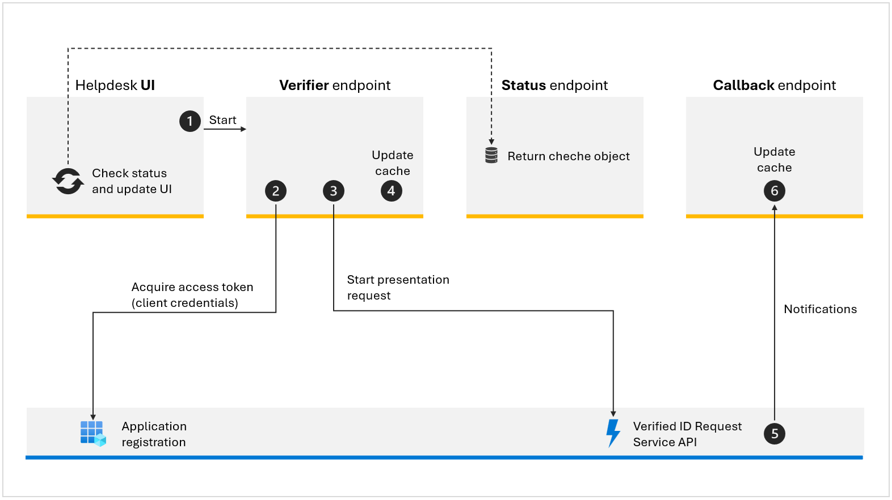

# Helpdesk prove request

The diagram below outlines the components and the flow of a presentation request



1. To initiate the verification process, a helpdesk personnel enters the user's UPN and phone number (to which the notification will be sent). A JavaScript code then calls the [Verifier endpoint](./Controllers/VerifierController.cs).
1. The **Verifier endpoint**  conducts several input validations, such as verifying the validity of the UPN. Then, it acquires an access token utilizing the client credentials flow through an application registration in Microsoft Entra ID (with the respective permissions). 
1. The **Verifier endpoint**
    1. Generates a JSON payload like the one below. The payload includes the `request.Callback.State` with a generated unique identifier. This ID is crucial for correlating the callback event with the state included in the original payload and it's used as the key for the cache object. 
    1. With both the JSON payload and access token ready, it subsequently starts an HTTP **POST** request to the Microsoft Entra verified ID **Request Service REST API**.

    ```json
    {
        "authority": "did:web:did.woodgrove.com",
        "includeQRCode": false,
        "registration": {
            "clientName": "Woodgrove helpdesk",
            "purpose": "Prove your identity"
        },
        "callback": {
            "url": "https://woodgrove.com/api/verifier/presentationcallback",
            "state": "23377504-74c1-4a95-913d-86e865f71ac1",
            "headers": {
                "api-key": "<API key to help protect your callback API>"
            }
        },
        "includeReceipt": false,
        "requestedCredentials": [
            {
                "type": "VerifiedEmployee",
                "acceptedIssuers": [
                    "did:web:did.woodgrove.com"
                ],
                "configuration": {
                    "validation": {
                        "allowRevoked": false,
                        "validateLinkedDomain": true
                    }
                },
                "constraints": [
                    {
                        "claimName": "revocationId",
                        "values": [
                            "10@sample.com"
                        ]
                    }
                ]
            }
        ]
    }
    ```

1. If the **Request Service REST API** call is successful: 
    1. It returns a response code (HTTP 201 Created), and a collection of event objects in the response body.
    1. The `url` is that launches the authenticator app and starts the presentation process. Applications can present this URL through a web hyperlink, QR code, or push notification. 
    
    The following JSON demonstrates a successful response:

    ```json
    {
        "requestId": "e4ef27ca-eb8c-4b63-823b-3b95140eac11",
        "url": "openid-vc://?request_uri=https://verifiedid.did.msidentity.com/v1.0/00001111-aaaa-2222-bbbb-3333cccc4444/verifiableCredentials/presentationRequests/e4ef27ca-eb8c-4b63-823b-3b95140eac11",
        "expiry": 1633017751
    }
    ```
    
    1. It uses in memory cache to keep state about the request. The key is the state value from the `request.Callback.State` attribute in the request. The UI will check the state when calling the [Status endpoint](./Controllers/RequestStatusController.cs).
1. The callback endpoint is called when a user scans the QR code, uses the deep link to the Authenticator app, or finishes the presentation process. The payload contains information like the `state` value that you passed in the original payload (we use it as a key for the cache object), `requestStatus`, `claims` and more. 
1. The **callback endpoint** updates the chache with the latest status, so the UI can check the state when calling the [Status endpoint](./Controllers/RequestStatusController.cs).


## App settings

- **VerifiedID:ApiEndpoint** - Use this `https://verifiedid.did.msidentity.com/v1.0/verifiableCredentials/` value.
- **VerifiedID:TenantId** - Your Microsoft Entra tenant ID.
- **VerifiedID:Authority** - Use `https://login.microsoftonline.com/`.
- **VerifiedID:scope** - Use this `3db474b9-6a0c-4840-96ac-1fceb342124f/.default` value.
- **VerifiedID:ClientId** - The application ID you registered for the verified ID.
- **VerifiedID:CertificateThumbprint** - The certificate thumbprint you uploaded to the application you registered for the verified ID.
- **VerifiedID:DidAuthority** - The DID identifier of your verified ID (from [Entra admin center](https://entra.microsoft.com))
- **VerifiedID:Presentation** - Settings for the presentation request
    - VerifiedID:Presentation:**ClientName** - A display name of the verifier of the verified ID credential. This name is presented to the user in the authenticator app.
    - VerifiedID:Presentation:**Purpose** - A string that is displayed to inform the user why the verified ID credentials are being requested.
    - VerifiedID:Presentation:**CredentialType** - Use `VerifiedEmployee`
    - VerifiedID:Presentation:**UseFaceCheck** - Determine if a face-check will be conducted
    - VerifiedID:Presentation:**SourcePhotoClaimName** - The name of the claim in the credential that contains the photo. Use `photo`.
    - VerifiedID:Presentation:**MatchConfidenceThreshold** - The confidential threshold for a successful check between the photo and the liveness data. Must be an integer between 50 and 100. The default is 70.
    - VerifiedID:Presentation:**UpnConstraint** - Determines whether a constraint with the user's UPN needs to be included in the presentation request.
    
